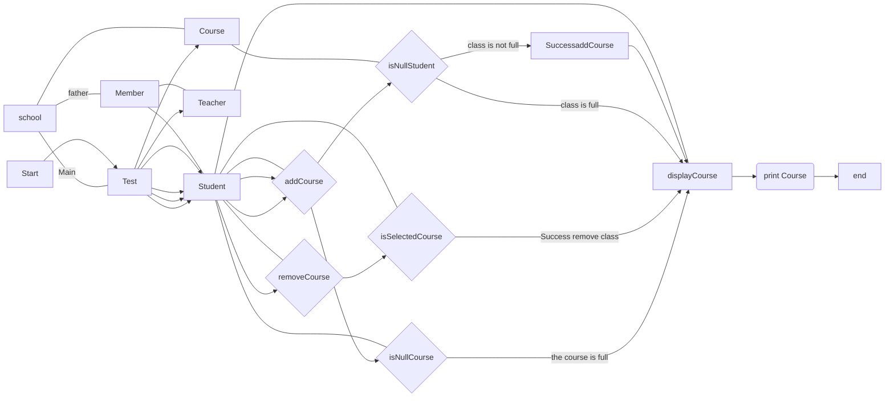

```mermaid
graph LR;
Start-->Test
school---|father|Member
school---Course
school---|Main|Test
Member---Teacher
Member---Student
Test-->Course
Test-->Teacher
Test-->Student
Student---id1{addCourse}
Student---id2{removeCourse}
Student---id0[displayCourse]
Student---id8{isSelectedCourse}
Student---id9{isNullCourse}
Course---id6{isNullStudent}
Test-->Student-->id1{addCourse}-->id6{isNullStudent}-->|class is not full|SuccessaddCourse-->id0[displayCourse]
id6{isNullStudent}-->|class is full|id0[displayCourse]
Test-->Student-->id2{removeCourse}-->id8{isSelectedCourse}-->|Success remove class|id0[displayCourse]
Test-->Student-->id1{addCourse}-->id9{isNullCourse}-->|the course is full|id0[displayCourse]
id0[displayCourse]-->E(print Course)-->G[end]
```

